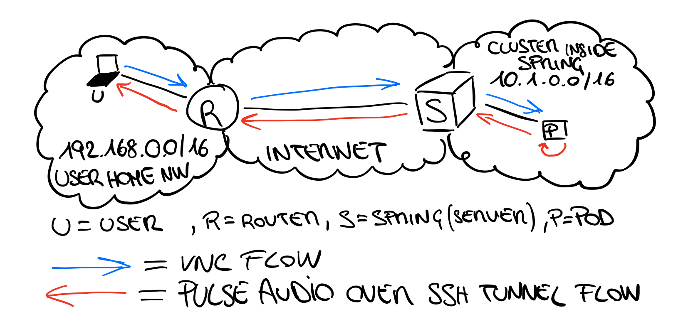
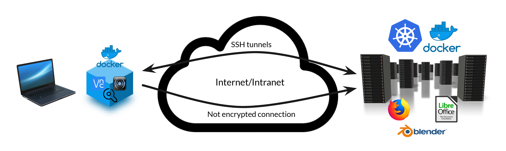
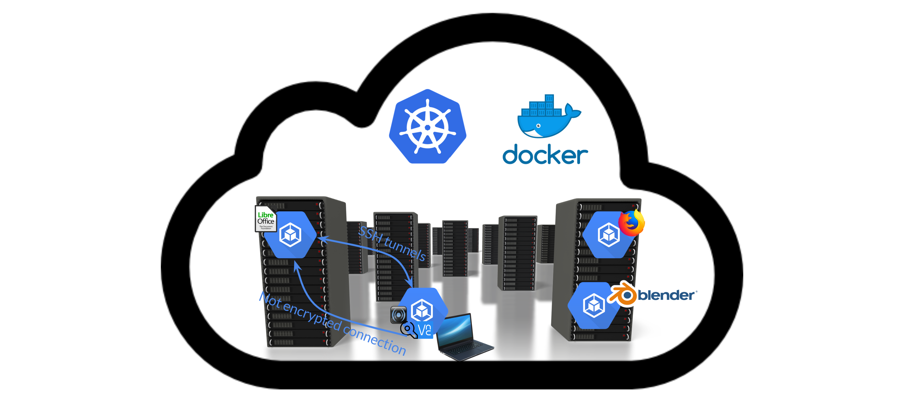
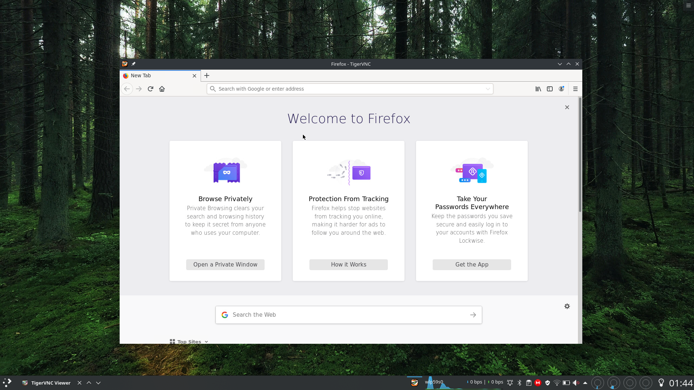
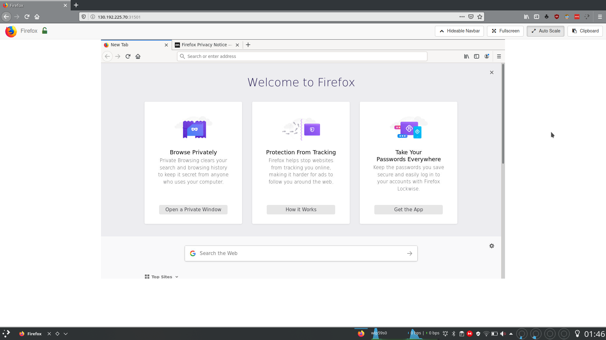

# Kubernetes On Desktop
## Developed by: 
* **Simone Magnani** (release/v1.0) 
* **Antonio Riccardo Roccaro** (release/v2.0)

## Tutor: 
* **Fulvio Risso**
* **Alex Palesandro**

## Version: 
v2.0

## Presentation slides: 
* [KubernetesOnDesktop release/v1.0 - Magnani](https://docs.google.com/presentation/d/15Dj8vwPaAyB_QmC_4886_E1K4pc7DzzlEPeiWJJMcCI/edit#slide=id.g742e3e7cd_1_16)
* [KubernetesOnDesktop release/v2.0 - Roccaro](https://docs.google.com/presentation/d/16z3NjHMjUr7YS_KgGWZ5komRSfAWSNqNonW72dKzagI/edit?usp=sharing)

## Introduction
KubernetesOnDesktop is a university project with the aim of developing a cloud infrastructure to run user application in a remote cluster. Thanks to the Netgroup Polito cluster, we have developed a very high performing infrastructure to let run applications on k8s and connect to them via many protocols.

To make modifications persistent, we decided to create a PersistentVolumeClaim for each different application so that all the users remote preferences and files are restored at every execution to improve the user experience.
So far, the supported applications are [Firefox](https://www.mozilla.org/it/firefox), [Libreoffice](https://it.libreoffice.org) and [Blender](https://www.blender.org). All the remote and local k8s/docker resources created will be destroyed when the execution ends.

Interestingly, depending on the connection quality and on the `pod` availability, the required application will be executed in Cloud or in the local user computer (if it natively exists). This is a user-friendly feature to not alter the normal execution behavior in certain particular cases. Everything is tunable user-side like connection quality, program executed, compression, encryption etc.

## Used technologies
* TigerVNC
* NoVNC
* SSH server
* Openbox (light window manager)
* Some utility tools (wget, net-tools, locales, xdotool, python-numpy used for websockify/novnc, xorg)
* Firefox, Libreoffice, Blender (once per docker image)

These not only allows our infrastructure to be reachable both via a VNC client and browser, but they also ensure that everything fits user needs and tastes.

## Dependencies
* Kubectl
* VNC viewer
* vncpasswd (present in any vnc server package)
* Netcat

VNC viewer and `vncpasswd` are required only in native mode execution (see [run modes](#how-it-works) below). In the other cases (docker container or k8s `pod`) it is already integrated inside the docker images.

While in native mode execution Kubectl is mandatory, Netcat and VNC viewer can be replaced by other application modifying the script. However, make sure that the ones you want to use are compatible with all the parameters (quality, compression), otherwise you may not achieve the same result.

**Note**
Due to the usage of `vncpasswd` command to automatically encrypt the password from the command line, also the vncserver dependency should be installed while using native run mode. There are no current `vncpasswd` standalone installation.

## Supported Applications
This is the second version of the project, so we preferred to keep on going by focusing on the quality of our services instead of the quantity.

The supported ones are:
* Firefox
* Libreoffice
* Blender (also available with NVIDIA CUDA graphic card support)

## How it works
For the sake of simplicity, in this draw (representing the main scenario) it has been omitted the entire network infrastructure (routers, other servers on cluster, etc.) of the cluster, leaving only the element in question.  



As you can see in the picture above, the architecture can be splitted in two sides:
* a server-side (the *cluster* one in the picture) that is in charge of executing the target application in a (remote) cluster;
* a client-side (the *user home* one in the picture) that is in charge to remotize the target application GUI through VNC and PulseAudio.

The client-side has three different run modes and, depending on which run-mode will be used, the implementation of the architecture above may be a little bit different:
1. Native run mode, in which as suggested by its name, there is a vncviewer application installed ad used natively in the user machine. So, the architecture implementation is actually the one represented in the picture above.

2. Docker container run mode, in which the client side required software (vncviewer, vncpasswd and PulseAudio server) is installed and runned inside a docker container. The architecture implementation is a little bit different because the flows occur between the (local) docker container and the (remote) k8s `pod` (see the picture below).



3. Kubernetes `pod` run mode, in which, as the previous run mode, the client side required software is installed inside a docker image but executed inside a k8s `pod`. Again, this time the architecture implementation is a little bit different because both the client and the server must be two nodes of the same kubernetes cluster and the flows occur between two k8s `pod`s in that cluster (see the picture below).



## Application execution phases
The application execution can be splitted in two parts:
1. The [deployment of the server-side](deployment-of-the-server-side)
2. The [deployment of the client-side](deployment-of-the-client-side)

### Deployment of the server-side
The server-side deployment consists in the following steps:

1. a temp copy of the deployment file will be modified according to the user preferences. In fact, the template file contains all the possible combination of port/services used, and the `cloudify` script modifies them at every execution to deploy the desired system;

2. network connectivity and speed will be checked in order to decide whether to run the application locally or in the cluster. To accomplish that, we have used a simple `kubectl describe pods` command, because it not only allows us to understand if network is up, but it also tells us your network/cluster condition. We could have used a `kubectl get version` command, but it is always very reactive and sometimes cached, while getting all `pod`s (or every other resource) requires a bit of computation, which is cool to be considered;

3. a new token (to be used for the VNC server authentication ) and a new SSH key pair with no passphrase (to be used as authN for the new connection) will be generated. The SSH keys are extremely important, since they are used to map the remote `pod` PulseAudio local port to the user PulseAudio TCP server, launched later;

4. The cluster will be prepared by creating a namespace and applying some labels to control the client-side (if run mode is k8s `pod`) and server-side pods scheduling;

5. a k8s `secret` containing the the SSH public key will be genereted. This secret will be mounted inside the remote `pod`;

6. the deploy is applied to the cluster and the process will wait for the target application `pod` state changes to `RUNNING`.

Of course every phase has its own controls to be sure that the following step executes only if all the previous succeeded.

### Deployment of the client-side 
Once the target application `pod`'s state it `RUNNING`, the deployment of the client-side will be done by executing the following steps:

1. Retrieving all the useful information like the IP to contact, the PORT opened for the services and the assigned `pod` name. This is not required if run mode is k8s `pod` because wont't be used the NodePort but the [DNS for service](https://kubernetes.io/docs/concepts/services-networking/dns-`pod`-service/);

2. Depending on run mode:
   * Native: will be loaded the PulseAudio module-native-protocol-tcp, opened the reverse-port-forwarding SSH tunnel (to forward the audio), launched the vncviewer (or Firefox if noVNC is used));
   * Docker container: will be created and executed the container that follows the same workflow of native run mode inside;
   * k8s `pod`: will be modified a temp copy of the vncviewer.yaml file according to the parameter required to run vncviewer inside the `pod`, applied the vncviewer.yaml `job` to the cluster and waited for the vncviewer `job` to be completed.

In every cases, the connection phase starts with a mandatory remote port forwarding for the audio and an optional local port forwarding for the encrypted VNC/noVNC connection, depending whether the encryption has been previously enable or not.

Finally, once the client terminates, the script handles the final phase, where all the (local or remote) created resources will be deleted, the ssh connections are closed and the PulseAudio TCP server is shut down.

### SSH keys and One time Token
As previously anticipated, each run generates a new SSH key pair in the directory `/tmp/Cloudify/` where also the used deployment has been copied. These information are one-shot, meaning that the next run will generate new ones starting from scratch. 

Even though user chooses not to encrypt the connection, the VNC session, that in this case could be sniffed with a MITM attack, is still password-protected. The password is a One Time Token generated before applying the deploy remotely and will be used to connect to the `pod` both with the two protocols. In case of noVNC, a pop-up with your secret token will appear on your screen, allowing you to copy and paste it directly in your browser.

## Installation
To install KubernetesOnDesktop on your machine you can just use the follwing installation command:

```bash
sudo curl -L https://raw.githubusercontent.com/netgroup-polito/KubernetesOnDesktop/master/install.sh | sudo bash -s -- --remote
```

**Note** Don't forget to install all the required dependencies (Kubectl, Docker, vncviewer and vncpasswd) to make the application works properly.

## Usage
Once all the dependencies are installed, since it is a cloud based application you don't have to install anything else.

The user must use the `cloudify` script to launch the desired application. To use it, type in a terminal:

```bash
user@hostname:~$ cloudify firefox
```

Actually there are a lot of optional parameter as reported in the script usage:

```bash
Run application in Cloud using Kubernetes as orchestrator.
Usage: ./cloudify [-h] [-e] [-t timeout] [-p protocol] [-q quality] [-c compression] [-r runmode] app_name
|-> -h: start the helper menu
|-> -e: specify that the connection must be encrypted (0/1, default 0 disabled)
|-> -t: connection/wait timeout in seconds (positive number, default 60)
|-> -p: connection protocol to be used (vnc/novnc, default vnc)
|-> -q: specify the quality of the connection (0-9, default 5)
|-> -c: specify the compression of the connection (0-6, default 2)
|-> -v: specify whether to use the pvc or not (0-no/1-yes, default 0)
|-> -r: vncviewer run mode:
|       0-> native app
|       1-> docker container
|       2-> k8s `pod`
|       default-> 0 (native app).
|       Warning: this option can't be used if '-p novnc' is set
|
|-> app_name: application to run. Supported applications: firefox,libreoffice,blender,cuda-blender
|
|->Example: ./cloudify firefox
|->Example: ./cloudify -q 7 -t 10 -e firefox
|->Example: ./cloudify -q 7 -t 10 -e -r 1 firefox
```

If everything was correct, a vncviewer window rendering the application will appear. Interestingly, you now not only can play the remote audio, but also controlling it. 

**Note** As you can see above, one of the supported `app_name` is `cuda-blender`. This way you can run `blender` using the NVIDIA CUDA graphic card if the `pod` where it is running in has been scheduled on a node having a NVIDIA CUDA graphic card with its drivers installed (see [NVIDIA Quickstart](https://github.com/NVIDIA/nvidia-docker#quickstart)).

Firefox (VNC)



Firefox (noVNC)



## Uninstall
To uninstall KubernetesOnDesktop simply run the following command:

```bash
cloudify-uninstall
```

**Note** During the uninstall process will be asked if you want to remove the `k8s-on-desktop` namespace too. This is because by removing it all the Persistent Volume Claims will be removed too resulting in a REMOTE CONFIGURATION AND DATA LOST for each application!!! So, BE CAREFUL when chosing whether to remove it or not.

## Acknowledgments

Professor Risso

* <https://github.com/frisso>

PhD Alex Palesandro

* <https://github.com/palexster>
