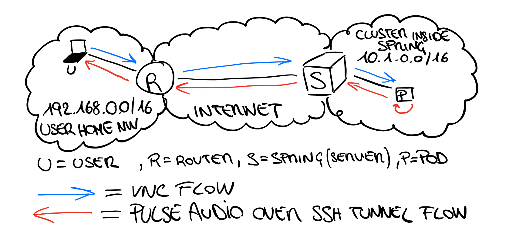
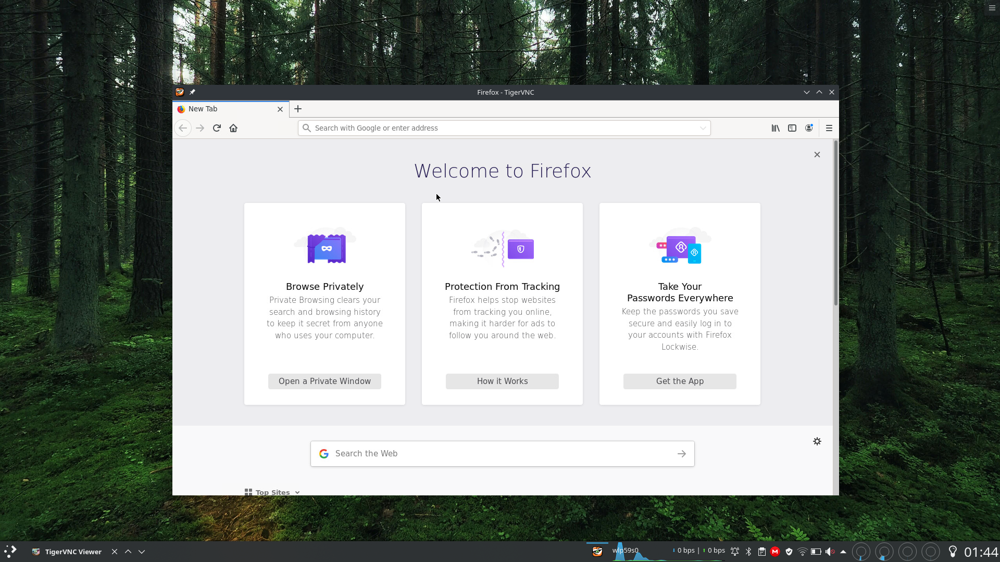
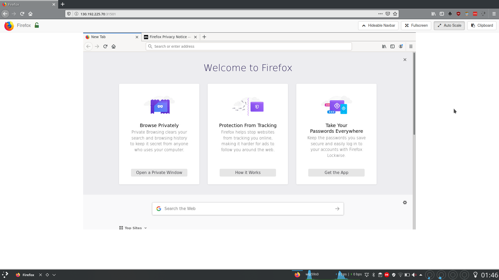

# Kubernetes On Desktop

Project duration: 10 person weeks

Developed by: **Simone Magnani**

Tutor: **Fulvio Risso** - **Alex Palesandro**

Version: 1.0

Presentation slides: [KubernetesOnDesktop](https://docs.google.com/presentation/d/15Dj8vwPaAyB_QmC_4886_E1K4pc7DzzlEPeiWJJMcCI/edit#slide=id.g742e3e7cd_1_16)

## Description

Cloud Computing course project with the aim of developing a cloud infrastructure to run user application in a remote cluster.

Thanks to the Netgroup Polito cluster, we have developed a very high performing infrastructure to let correctly configured users deploy applications and connect to them via many protocols.

To make modifications persistent, we decided to create a PersistentVolumeClaim for each different kind of application, thanks to all the users preferences are restored at every execution to improve the experience. 

The actual program supported are Firefox and Libreoffice. The execution unit will be destroyed together with all the deployments once the user has finished to use it.

Interestingly, depending on the connection quality and on the pod availability, the required application will be executed in Cloud or in the local user computer. This is a user-friendly feature not to alter the normal execution behavior in certain particular cases.

Everything is tunable user-side like connection quality, program executed, compression, encryption etc.

## Technologies used

* TigerVNC
* NoVNC
* SSH server
* Openbox (light window manager)
* Some utility tools (wget, net-tools, locales, xdotool, python-numpy used for websockify/novnc)
* Firefox/Libreoffice (once per docker image)

These not only allows our infrastructure to be reachable both via a VNC client and browser, but they also ensure that everything fits user needs and tastes.

## Dependencies

* Kubectl
* VNC viewer
* Netcat

While Kubectl is mandatory, Netcat and VNC viewer can be replaced by other application modifying the script. However, make sure that the ones you want to use are compatible with all the parameters (quality, compression), otherwise you may not achieve the same result.

## Supported Applications

This is the first version of the project, so we preferred to focus on the quality of our services instead than the quantity.

The supported ones are:

* Firefox
* Libreoffice

## How it works

For the sake of simplicity, in this draw it has been omitted the entire network infrastructure (routers, other servers on cluster, etc.) of the cluster, leaving only the element in question.  




### Deployment Phases

As first, network connectivity and speed is checked in order to decide whether to run the application locally or in the cluster. To accomplish that, we have used a simple `kubectl get pods` command, because it not only allows us to understand if network is up, but it also tells us your network/cluster condition. We could have used a `kubectl get version` command, but it is always very reactive and sometimes cached, while getting all pods (or every other resource) requires a bit of computation, which is cool to be considered.

The second step is to modify the deployment file according to the user preferences. In fact, the template file contains all the possible combination of port/services used, and the `cloudify` script modifies them at every execution to deploy the desired system. Once finished, the deploy is applied to the cluster and, if it succeeds, the script looks for all the useful information like the IP to contact, the PORT opened for the services and the assigned pod name. Furthermore, in the mean time it is automatically generated a new SSH key pair with no passphrase to be used as authN for the new connection. The SSH keys are extremely important, since they are used to map the remote pod PulseAudio local port to the user PulseAudio TCP server, launched later.

Once gathered pod's information, the program waits for the pod to change it's state to RUNNING, meaning that it's ready to be contacted. Of course every phase has its own controls to be sure that the following step executes only if all the previous succeeded. In this phase the public RSA key is copied to the specific pod and it is started the local PulseAudio TCP server. The user is now ready to connect.

The connection phase starts with a mandatory remote port forwarding for the audio and an optional local port forwarding for the encrypted VNC/noVNC connection, depending whether the encryption has been previously enable or not. If these command succeed, the connection starts using the right client (vncviewer or a browser).

A huge difference between the two client is that if a vncviewer is used, the user has still the possibility to change at run time some parameter to tune the connection quality as he wants, while if it using noVNC this is not allowed.

Finally, once the client terminates, the script handles the final phase, where the deploy is remotely deleted, the ssh connections are closed and the PulseAudio TCP server is shut down.

### SSH keys and One time Token

As previously anticipated, each run generates a new SSH key pair in the directory `/tmp/Cloudify/` where also the used deployment has been copied. These information are one-shot, meaning that the next run will generate new ones starting from scratch. 

Even though user chooses not to encrypt the connection, the vnc session, that in this case could be sniffed with a MITM attack, is still password-protected. The password is a One Time Token generated before applying the deploy remotely and will be used to connect to the pod both with the two protocols. In case of noVNC, a pop-up with your secret token will appear on your screen, allowing you to copy and paste it directly in your browser.


## Usage

Once all the dependencies are installed, since it is a cloud based application you don't have to install anything else.

The user must use the `cloudify` script to launch application, or use the various desktop launchers created. It is strongly suggested that he has a local installation of that application, since the script will automatically launch it if there are some connection or cluster availability errors.

To use it, type in a terminal:

```bash
user@hostname:~/WorkingDirectory$ ./cloudify firefox
```

Actually there are a lot of optional parameter as reported in the script usage:

```bash
Run application in Cloud using Kubernetes as orchestrator.
Usage: ./cloudify [-h] [-e] [-t timeout] [-p protocol] [-q quality] [-c compression] app_name
|-> -h: start the helper menu
|-> -e: specify that the connection must be encrypted (0/1, default 0 disabled)
|-> -t: connection/wait timeout in seconds (positive number, default 60)
|-> -p: connection protocol to be used (vnc/novnc, default vnc)
|-> -q: specify the quality of the connection (0-9, default 4)
|-> -c: specify the compression of the connection (0-6, default 3)
|
|->Example: ./cloudify firefox
|->Example: ./cloudify -q 7 -t 10 -e firefox
```

If everything was correct, a vncviewer window rendering the application will appear. Interestingly, you now not only can play the remote audio, but also controlling it. 

Firefox (VNC)



Firefox (noVNC)




## Acknowledgments

Professor Risso

* <https://github.com/frisso>

PhD Alex Palesandro

* <https://github.com/palexster>
